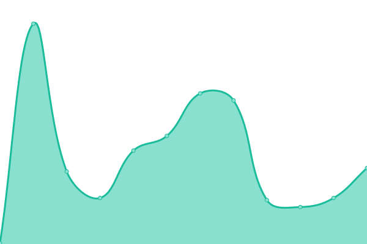

# [📈 Live Status](https://status.stardream.online): <!--live status--> **🟧 Partial outage**

This repository contains the open-source uptime monitor and status page for [STDM](https://status.stardream.online), powered by [Upptime](https://github.com/upptime/upptime).

With [Upptime](https://upptime.js.org), you can get your own unlimited and free uptime monitor and status page, powered entirely by a GitHub repository. We use [Issues](https://github.com/STDM-Group/upptime/issues) as incident reports, [Actions](https://github.com/STDM-Group/upptime/actions) as uptime monitors, and [Pages](https://status.stardream.online) for the status page.

<!--start: status pages-->
<!-- This summary is generated by Upptime (https://github.com/upptime/upptime) -->
<!-- Do not edit this manually, your changes will be overwritten -->
<!-- prettier-ignore -->
| URL | Status | History | Response Time | Uptime |
| --- | ------ | ------- | ------------- | ------ |
|  [Home Page](https://www.stardream.online) | 🟩 Up | [home-page.yml](https://github.com/STDM-Group/upptime/commits/HEAD/history/home-page.yml) | 

 229ms
     
 | 

<a href="https://status.stardream.online/history/home-page">100.00%</a>
    

|  [Blog](https://blog.stardream.online) | 🟩 Up | [blog.yml](https://github.com/STDM-Group/upptime/commits/HEAD/history/blog.yml) | 

 210ms
     
 | 

<a href="https://status.stardream.online/history/blog">100.00%</a>
    

|  [StarMedia](https://social.lolihouse.top) | 🟥 Down | [star-media.yml](https://github.com/STDM-Group/upptime/commits/HEAD/history/star-media.yml) | 

 302ms
     
 | 

<a href="https://status.stardream.online/history/star-media">0.00%</a>
    

|  [StarTube](https://video.lolihouse.top) | 🟩 Up | [star-tube.yml](https://github.com/STDM-Group/upptime/commits/HEAD/history/star-tube.yml) | 

 374ms
     
 | 

<a href="https://status.stardream.online/history/star-tube">100.00%</a>
    

|  [StarDrive](https://drive.stardream.online) | 🟩 Up | [star-drive.yml](https://github.com/STDM-Group/upptime/commits/HEAD/history/star-drive.yml) | 

 347ms
     
 | 

<a href="https://status.stardream.online/history/star-drive">100.00%</a>
    

|  Mail | 🟩 Up | [mail.yml](https://github.com/STDM-Group/upptime/commits/HEAD/history/mail.yml) | 

 419ms
     
 | 

<a href="https://status.stardream.online/history/mail">100.00%</a>
    

|  [Short Links](https://links.stardream.online) | 🟩 Up | [short-links.yml](https://github.com/STDM-Group/upptime/commits/HEAD/history/short-links.yml) | 

 383ms
     
 | 

<a href="https://status.stardream.online/history/short-links">100.00%</a>
    

|  [Cambia](https://cambia.stardream.online) | 🟩 Up | [cambia.yml](https://github.com/STDM-Group/upptime/commits/HEAD/history/cambia.yml) | 

 327ms
     
 | 

<a href="https://status.stardream.online/history/cambia">100.00%</a>
    

|  [IT-Tools](https://itool.stardream.online) | 🟥 Down | [it-tools.yml](https://github.com/STDM-Group/upptime/commits/HEAD/history/it-tools.yml) | 

 0ms
     
 | 

<a href="https://status.stardream.online/history/it-tools">0.04%</a>
    

|  [$TWIKOO_API](https://twikoo.stardream.online) | 🟩 Up | [twikoo-api.yml](https://github.com/STDM-Group/upptime/commits/HEAD/history/twikoo-api.yml) | 

 455ms
     
 | 

<a href="https://status.stardream.online/history/twikoo-api">100.00%</a>
    

|  CF R2 Bucket | 🟩 Up | [cf-r2-bucket.yml](https://github.com/STDM-Group/upptime/commits/HEAD/history/cf-r2-bucket.yml) | 

 1106ms
     
 | 

<a href="https://status.stardream.online/history/cf-r2-bucket">100.00%</a>
    

<!--end: status pages-->

[**Visit our status website →**](https://status.stardream.online)

## 📄 License

- Powered by: [Upptime](https://github.com/upptime/upptime)
- Code: [MIT](./LICENSE) © [Anand Chowdhary](https://anandchowdhary.com), supported by [Pabio](https://pabio.com)
- Data in the `./history` directory: [Open Database License](https://opendatacommons.org/licenses/odbl/1-0/)
