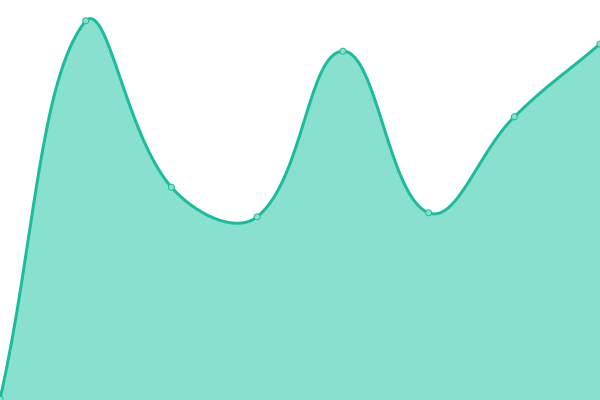
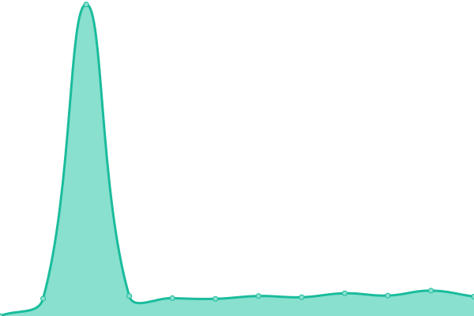
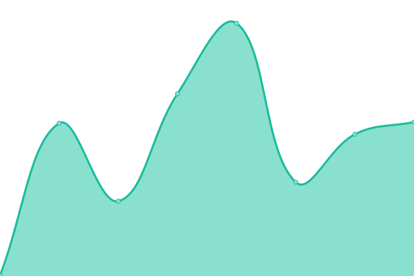
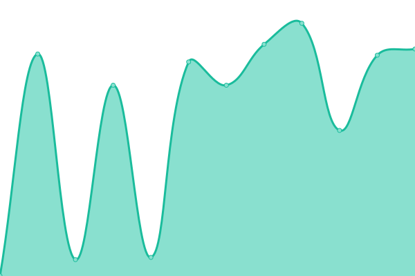
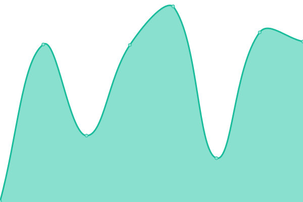
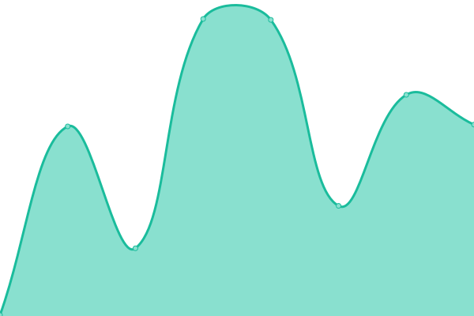
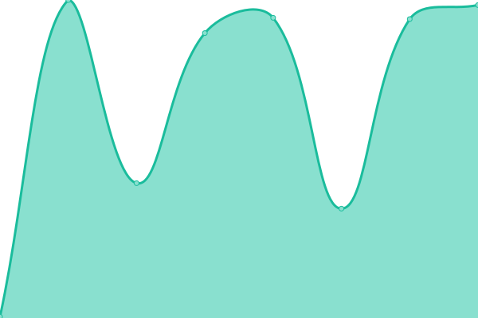
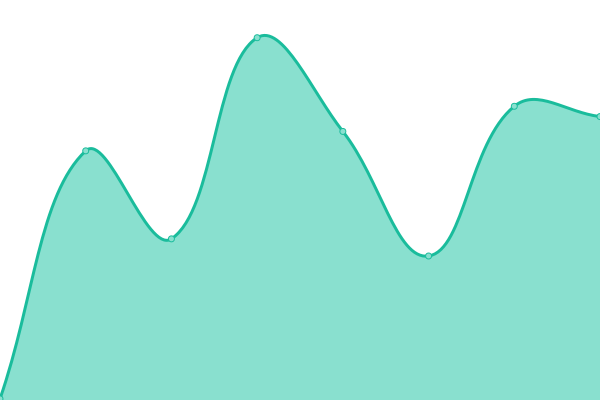
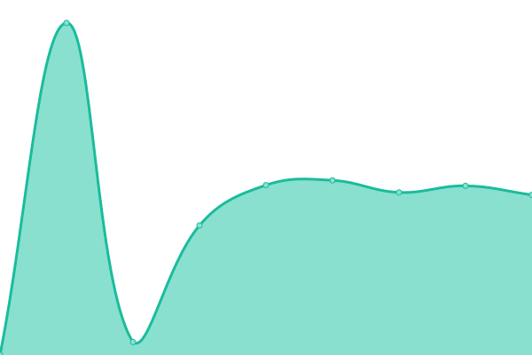

# [📈 Live Status](https://status.stardream.online): <!--live status--> **🟧 Partial outage**

This repository contains the open-source uptime monitor and status page for [STDM](https://status.stardream.online), powered by [Upptime](https://github.com/upptime/upptime).

With [Upptime](https://upptime.js.org), you can get your own unlimited and free uptime monitor and status page, powered entirely by a GitHub repository. We use [Issues](https://github.com/STDM-Group/upptime/issues) as incident reports, [Actions](https://github.com/STDM-Group/upptime/actions) as uptime monitors, and [Pages](https://status.stardream.online) for the status page.

<!--start: status pages-->
<!-- This summary is generated by Upptime (https://github.com/upptime/upptime) -->
<!-- Do not edit this manually, your changes will be overwritten -->
<!-- prettier-ignore -->
| URL | Status | History | Response Time | Uptime |
| --- | ------ | ------- | ------------- | ------ |
|  [Home Page](https://www.stardream.online) | 🟩 Up | [home-page.yml](https://github.com/STDM-Group/upptime/commits/HEAD/history/home-page.yml) | 

 176ms
     
 | 

<a href="https://status.stardream.online/history/home-page">99.68%</a>
    

|  [Blog - Main](https://blog.stardream.online) | 🟩 Up | [blog-main.yml](https://github.com/STDM-Group/upptime/commits/HEAD/history/blog-main.yml) | 

 197ms
     
 | 

<a href="https://status.stardream.online/history/blog-main">100.00%</a>
    

|  [Blog - Past](https://nas-y-blog.stardream.online) | 🟩 Up | [blog-past.yml](https://github.com/STDM-Group/upptime/commits/HEAD/history/blog-past.yml) | 

 2615ms
     
 | 

<a href="https://status.stardream.online/history/blog-past">98.04%</a>
    

|  [StarEvent](https://event.stardream.online) | 🟥 Down | [star-event.yml](https://github.com/STDM-Group/upptime/commits/HEAD/history/star-event.yml) | 

 624ms
     
 | 

<a href="https://status.stardream.online/history/star-event">0.00%</a>
    

|  [StarMedia](https://social.lolihouse.top) | 🟥 Down | [star-media.yml](https://github.com/STDM-Group/upptime/commits/HEAD/history/star-media.yml) | 

 399ms
     
 | 

<a href="https://status.stardream.online/history/star-media">0.00%</a>
    

|  [StarTube](https://video.lolihouse.top) | 🟩 Up | [star-tube.yml](https://github.com/STDM-Group/upptime/commits/HEAD/history/star-tube.yml) | 

 281ms
     
 | 

<a href="https://status.stardream.online/history/star-tube">100.00%</a>
    

|  StarServer | 🟩 Up | [star-server.yml](https://github.com/STDM-Group/upptime/commits/HEAD/history/star-server.yml) | 

 1040ms
     
 | 

<a href="https://status.stardream.online/history/star-server">99.61%</a>
    

|  [StarDrive](https://drive.stardream.online) | 🟩 Up | [star-drive.yml](https://github.com/STDM-Group/upptime/commits/HEAD/history/star-drive.yml) | 

 224ms
     
 | 

<a href="https://status.stardream.online/history/star-drive">99.22%</a>
    

|  StarCloud | 🟩 Up | [star-cloud.yml](https://github.com/STDM-Group/upptime/commits/HEAD/history/star-cloud.yml) | 

 1161ms
     
 | 

<a href="https://status.stardream.online/history/star-cloud">99.68%</a>
    

|  [Filecodebox](https://file.stardream.online) | 🟩 Up | [filecodebox.yml](https://github.com/STDM-Group/upptime/commits/HEAD/history/filecodebox.yml) | 

 595ms
     
 | 

<a href="https://status.stardream.online/history/filecodebox">99.29%</a>
    

|  Opengist | 🟩 Up | [opengist.yml](https://github.com/STDM-Group/upptime/commits/HEAD/history/opengist.yml) | 

 866ms
     
 | 

<a href="https://status.stardream.online/history/opengist">99.68%</a>
    

|  [StarTZ](https://tz.stardream.online) | 🟩 Up | [star-tz.yml](https://github.com/STDM-Group/upptime/commits/HEAD/history/star-tz.yml) | 

 217ms
     
 | 

<a href="https://status.stardream.online/history/star-tz">99.29%</a>
    

|  [StarLottery](https://lottery.stardream.online) | 🟩 Up | [star-lottery.yml](https://github.com/STDM-Group/upptime/commits/HEAD/history/star-lottery.yml) | 

 1075ms
     
 | 

<a href="https://status.stardream.online/history/star-lottery">99.15%</a>
    

|  [StarTBS](https://tieba.stardream.online) | 🟩 Up | [star-tbs.yml](https://github.com/STDM-Group/upptime/commits/HEAD/history/star-tbs.yml) | 

 285ms
     
 | 

<a href="https://status.stardream.online/history/star-tbs">99.68%</a>
    

|  [Steam Card](https://steam.stardream.online) | 🟩 Up | [steam-card.yml](https://github.com/STDM-Group/upptime/commits/HEAD/history/steam-card.yml) | 

 1025ms
     
 | 

<a href="https://status.stardream.online/history/steam-card">99.39%</a>
    

|  [osu!next](https://osusig.stardream.online) | 🟩 Up | [osu-next.yml](https://github.com/STDM-Group/upptime/commits/HEAD/history/osu-next.yml) | 

 160ms
     
 | 

<a href="https://status.stardream.online/history/osu-next">99.61%</a>
    

|  [Cambia](https://cambia.stardream.online) | 🟩 Up | [cambia.yml](https://github.com/STDM-Group/upptime/commits/HEAD/history/cambia.yml) | 

 191ms
     
 | 

<a href="https://status.stardream.online/history/cambia">99.15%</a>
    

|  [IT-Tools](https://itools.stardream.online) | 🟩 Up | [it-tools.yml](https://github.com/STDM-Group/upptime/commits/HEAD/history/it-tools.yml) | 

 198ms
     
 | 

<a href="https://status.stardream.online/history/it-tools">99.29%</a>
    

|  [Blue Archive Logo Generator](https://ba-logo.stardream.online) | 🟩 Up | [blue-archive-logo-generator.yml](https://github.com/STDM-Group/upptime/commits/HEAD/history/blue-archive-logo-generator.yml) | 

 188ms
     
 | 

<a href="https://status.stardream.online/history/blue-archive-logo-generator">99.22%</a>
    

|  [Docker Mirror](https://docker.stardream.online) | 🟩 Up | [docker-mirror.yml](https://github.com/STDM-Group/upptime/commits/HEAD/history/docker-mirror.yml) | 

 272ms
     
 | 

<a href="https://status.stardream.online/history/docker-mirror">63.61%</a>
    

|  [Matrix](https://matrix.lolihouse.top/_matrix/static/) | 🟥 Down | [matrix.yml](https://github.com/STDM-Group/upptime/commits/HEAD/history/matrix.yml) | 

 885ms
     
 | 

<a href="https://status.stardream.online/history/matrix">0.00%</a>
    

|  Mail | 🟥 Down | [mail.yml](https://github.com/STDM-Group/upptime/commits/HEAD/history/mail.yml) | 

 0ms
     
 | 

<a href="https://status.stardream.online/history/mail">0.00%</a>
    

|  [Short Links](https://links.stardream.online) | 🟩 Up | [short-links.yml](https://github.com/STDM-Group/upptime/commits/HEAD/history/short-links.yml) | 

 232ms
     
 | 

<a href="https://status.stardream.online/history/short-links">99.54%</a>
    

|  Twikoo API | 🟩 Up | [twikoo-api.yml](https://github.com/STDM-Group/upptime/commits/HEAD/history/twikoo-api.yml) | 

 241ms
     
 | 

<a href="https://status.stardream.online/history/twikoo-api">99.29%</a>
    

|  Gitcalendar API | 🟩 Up | [gitcalendar-api.yml](https://github.com/STDM-Group/upptime/commits/HEAD/history/gitcalendar-api.yml) | 

 576ms
     
 | 

<a href="https://status.stardream.online/history/gitcalendar-api">99.29%</a>
    

|  [Fcircle API](https://fcircle.stardream.online/all) | 🟥 Down | [fcircle-api.yml](https://github.com/STDM-Group/upptime/commits/HEAD/history/fcircle-api.yml) | 

 684ms
     
 | 

<a href="https://status.stardream.online/history/fcircle-api">0.00%</a>
    

|  CF R2 Bucket | 🟩 Up | [cf-r2-bucket.yml](https://github.com/STDM-Group/upptime/commits/HEAD/history/cf-r2-bucket.yml) | 

 181ms
     
 | 

<a href="https://status.stardream.online/history/cf-r2-bucket">99.22%</a>
    

<!--end: status pages-->

[**Visit our status website →**](https://status.stardream.online)

## 📄 License

- Powered by: [Upptime](https://github.com/upptime/upptime)
- Code: [MIT](./LICENSE) © [Anand Chowdhary](https://anandchowdhary.com), supported by [Pabio](https://pabio.com)
- Data in the `./history` directory: [Open Database License](https://opendatacommons.org/licenses/odbl/1-0/)
